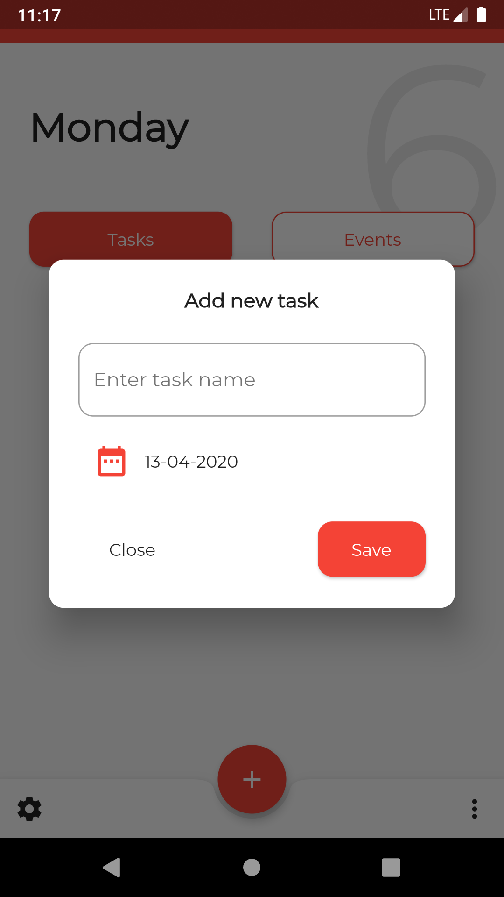
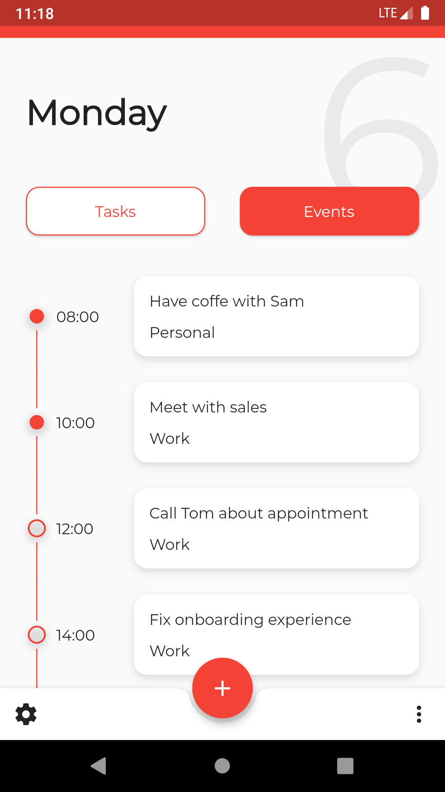
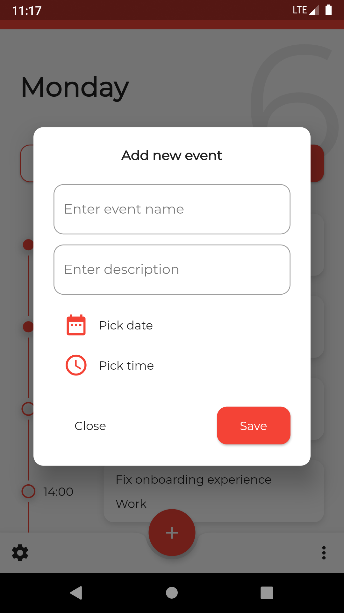

# To-do List App 👋


An elegant Todo and Event organisation app built with Flutter

## Screenshots

||||
|--|--|--|
|  |  | |
|  |  | |

# Command

## Commands

### Install dependencies

```sh
flutter pub get
```

### Run application

```sh
flutter emulators --launch <emulator_name>
flutter run
```

### Generate MOOR

```sh
flutter packages pub run build_runner build
```

### Build

```sh
flutter build apk
```

### Run tests

```sh
flutter test
```


# Plugins

- [moor_flutter](https://pub.dev/packages/moor_flutter)
- [intl](https://pub.dev/packages/intl)
- [provider](https://pub.dev/packages/provider)


